# Udacity-AML-Capstone

In this project, two models will be created, one using Azure Automated ML (AutoML), and one customized model whose hyperparameters are tuned using HyperDrive. The performance of two models are compared.

## Project Set Up and Installation

You can download the project from github with the following link:
https://github.com/leonchen34/Udacity-AML_Capstone.git.

To setup the project in AzureML, upload downloaded directory into studio notebook. 
To set up the project in AzureML, follow these steps to upload the downloaded directory into the Azure Machine Learning Studio Notebook environment. This assumes that you already have an AzureML workspace created.

(1)  Access Azure Machine Learning Studio:

Go to the Azure portal (https://portal.azure.com).
Navigate to your Azure Machine Learning workspace.

(2) Upload Project Directory:

In the left-hand menu of your AzureML workspace, click on "Notebooks".

Inside the Notebooks section, you'll see a "+" button to create a new folder. Click on it and give your project a name.

Click on the newly created folder to open it.

Inside the project folder, you'll see another "+" button, click on it to upload your downloaded directory.

There are three notebook files in this project. 

The notebook file "data_process.ipynb" is dedicated to the data processing stage. It takes the downloaded "output.csv" file from the data directory and performs necessary processing. The outcome of this process is the creation of two distinct files, namely "train.csv" and "test.csv". These files are intended to serve the purposes of training and testing in subsequent stages. 

"automl.ipynb" contains the notebook file to setting up AutoML training. The notebook initializes the AutoML experiment, retrieves the best-performing model, conducts testing, registers the model, and finally deploys it as a Web Service. 

In the "hyperparameter_tuning.ipynb" notebook, the focus is on utilizing HyperDrive to fine-tune hyperparameters specifically for the LogisticRegression model. The notebook outlines the configuration for the HyperDrive experiment, carries out the hyperparameter search, and identifies the best-tuned model. This best-tuned model is subsequently registered for future use.

## Dataset

### Overview

"Airbnb for Boston with fraud detcetion" data was downloaded from Kaggle with the following link:

https://www.kaggle.com/datasets/hawkingcr/airbnb-for-boston-with-fraud-detection/download?datasetVersionNumber=1

The downloaded file was saved as "output.csv" in the "data" directory. 

### Task

The dataset aims to classify whether an Airbnb listing is a fraud or not. 

A notebook file named "data_process.ipyng" was created to perform some pre-processing on the data. Firstly, a correlation analysis was conducted with the target column "fraud" to identify and remove some non-significant features. Next, the data was split into "train.csv" and "test.csv" sets, and the balance of the training data was examined. Due to the class imbalance in the training target, an upsampling technique was applied to address this imbalance.

### Access

Inside the "scripts" directory, you will find the script named data_set.py. This script contains two functions, namely getTrainingDataset() and getTestDataset(). These functions serve the purpose of registering the data files "train.csv" and "test.csv" as datasets within the Azure Machine Learning workspace. These datasets are named "airbnb_boston_training" and "airbnb_boston_test" respectively.

The getTrainingDataset() function operates in a way that if the "airbnb_boston_training" dataset is already registered, it returns this dataset. However, if the dataset is not registered, the function loads and registers the training data from the "train.csv" file. This procedure results in the creation of the "airbnb_boston_training" dataset.

Similarly, the getTestDataset() function employs a similar logic. If the "airbnb_boston_test" dataset is registered, the function returns this dataset. In the event that the dataset is not registered, the function loads and registers the test data from the "test.csv" file. Consequently, the "airbnb_boston_test" dataset is generated.

## Automated ML

The following settings and configurations are utilized for the AutoML process:

iteration_timeout_minutes: This parameter sets the time limit in minutes for each iteration. It's advisable to increase this value for larger datasets that necessitate more time per iteration. In this case, we've allocated 10 minutes per iteration, as the dataset is relatively small.

experiment_timeout_minutes: This setting defines the maximum cumulative time that all iterations are allowed to take before the experiment is terminated. Here, it's set to 30 minutes, which aligns with the dataset's smaller scale.

enable_early_stopping: By enabling this flag, early termination is initiated if the model's performance doesn't display improvements within a short duration.

primary_metric: Given the dataset's significant class imbalance, "AUC_weighted" is selected as the primary metric. This metric is suitable for imbalanced data scenarios.

featurization: The "auto" option is chosen to permit the experiment to preprocess the input data. This involves tasks such as handling missing data and converting text to numeric representations.

verbosity: This parameter regulates the level of logging information generated during the AutoML process.

n_cross_validation: As validation data isn't explicitly provided, the value for this parameter specifies the number of cross-validations to perform.

enable_onnx_compatible_models: This setting is enabled to ensure that, upon completion of the training process, an ONNX model will be retrieved as the result.

### Results

RunDetails output:

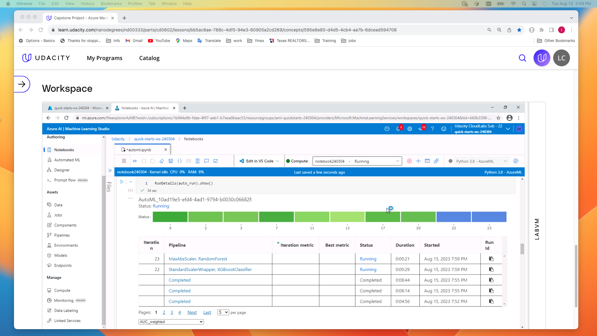

The best model is the one with algorithm  "StandardScaleWrapper, RandomForest":

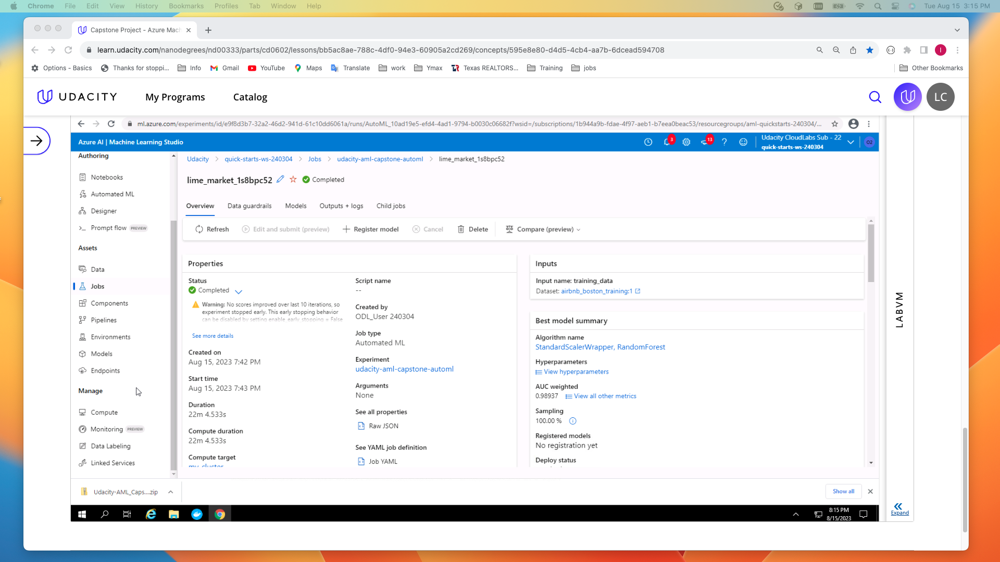

The best Model Metrics with accuracy 0.933:

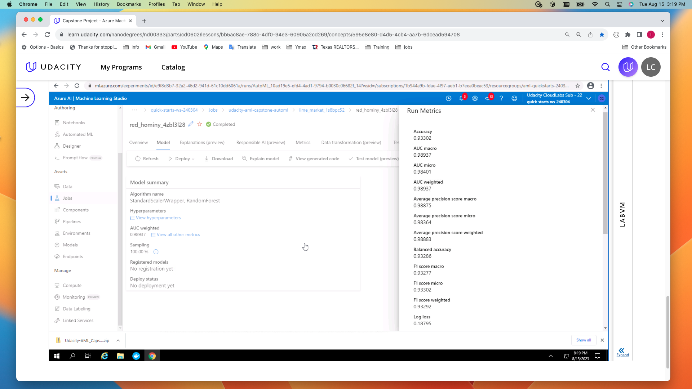

Given the parameter configuration with enable_onnx_compatible_models set to true in the AutoML settings, the outcome is the retrieval of an ONNX-compatible model.

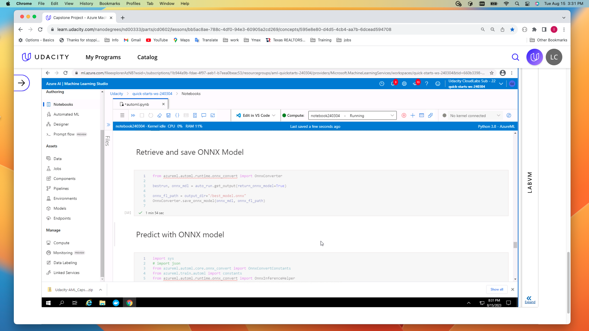

## Hyperparameter Tuning

Here a Logistic Regression model is the chosen approach. The model is fine-tuned using four key parameters. Among these, two parameters pertain to regularization: the inverse of regularization strength and the penalty term. The other two parameters are tied to optimization: the solver for the optimization method and the maximum number of iterations allowed for the solver to converge.

For parameter tuning, the Random sampling method is adopted. This method efficiently handles both continuous and discrete parameters, making the optimization process robust.

To ensure optimal resource utilization, an early termination policy is employed. Specifically, the aggressive BanditPolicy is selected, with a modest slack_factor of 0.1.

### Results

Rundetails:

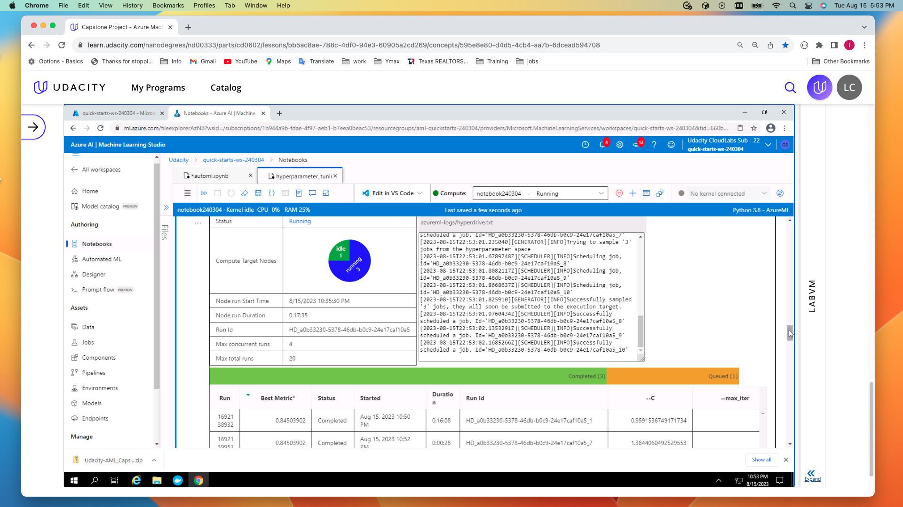

Run Error:

During the parameter tuning process, it's important to note that certain runs might result in errors due to incompatible parameter combinations. Specifically, such issues may arise when employing the newton-cholesky solver in conjunction with the L1 penalty term. 

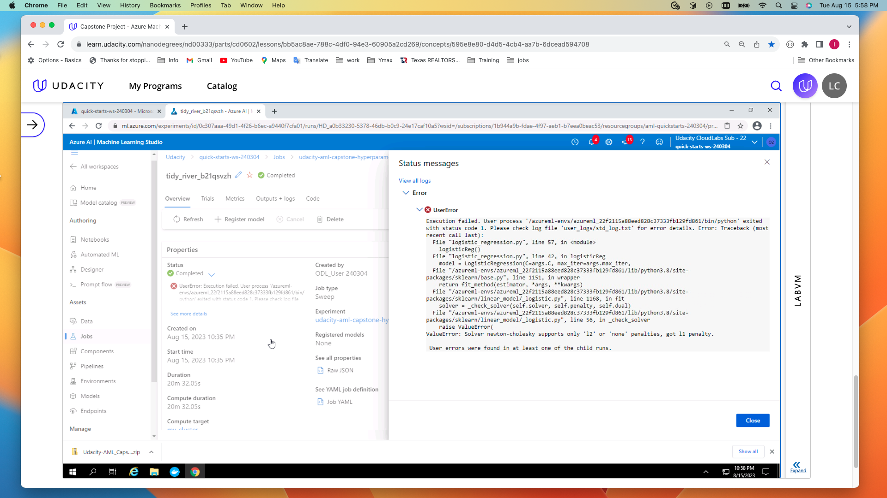

Best run has accuracy of 0.845:

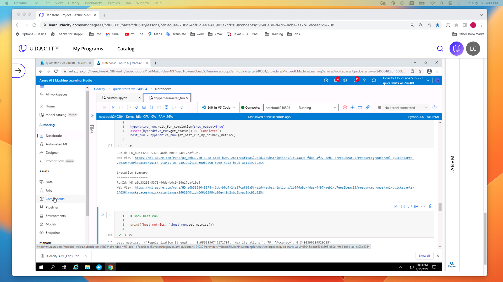

Model with best tunned parameters:

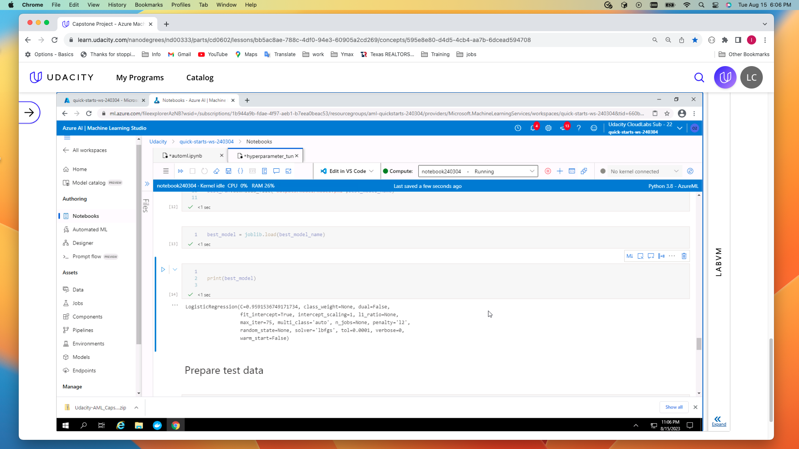

## Model Deployment

### Registered Models
The Best models for AutoML and Hyperparameter tunning are registered as follows:

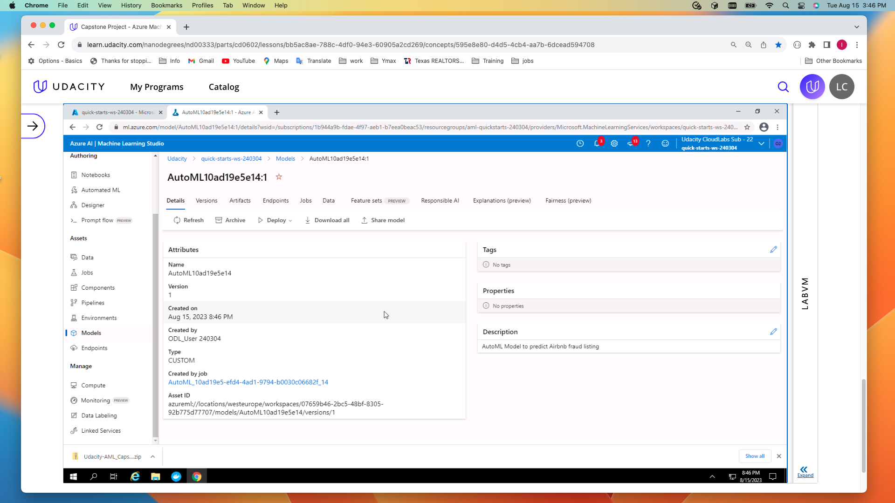

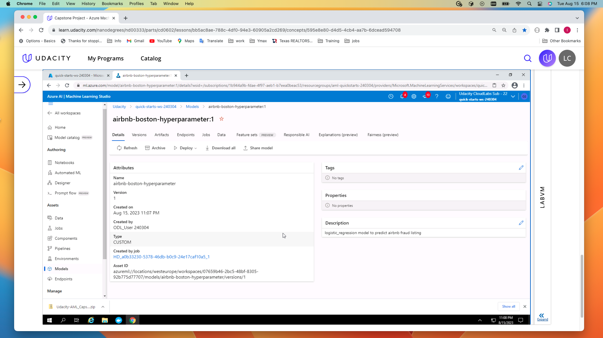

### Deployed endpoint

Since the best AutoML model has higher accuracy, it is deployed as AciWebservice. The following is the deployed endpoint:

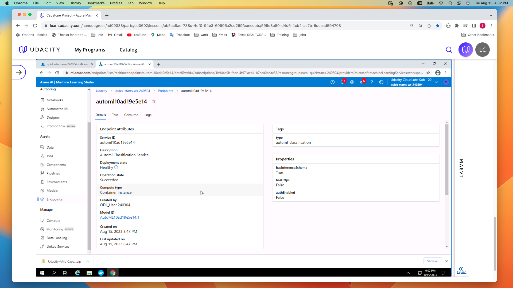

### Endpoint query

Within the "scripts" directory, you'll find the script named endpoint-test.py. This script is designed to facilitate querying the endpoint. A comparable code section has been executed within the AutoML Jupyter file, and the results have been displayed.

### Environment Settings

The environment settings for AutoML and Hyperdrive runs are defined in files
automl_env.yml and hyperdrive_env.yml respectively.

## Screen Recording

Here is the link to the YouTube video showcasing the published screencast:

https://youtu.be/5RsCwMSm5CM

## Future improvements

If feasible, an attempt will be made to acquire a larger dataset for training the models.

Based on the recommendation from the best AutoML algorithm, I could utilize the Random Forest classification model for the purpose of hyperparameter tuning.
